*gvnn: Neural Network Library for Geometric Vision*, ECCV Workshop on Deep Geometry, 2016 

*Ankur Handa, Michael Bloesch, Viorica Patraucean, Simon Stent, John McCormac, Andrew Davison*

Link to the paper [gvnn](http://arxiv.org/pdf/1607.07405.pdf)

What is gvnn?
=============

gvnn is primarily intended for self-supervised learning using low-level vision. It is inspired by the Spatial Transformer Networks (STN) paper that appeared in NIPS in 2015 and its open source code made available by [Maxime Oquab](https://github.com/qassemoquab/stnbhwd). The code is self contained *i.e.* the original implementation of STN by Maxime is also within the repository. 

STs were mainly limited to applying only 2D transformations to the input. We added a new set of transformations often needed for manipulating data in 3D geometric computer vision. These include the 3D counterparts of what were used in original STN together with a lot more new transformations and different M-estimators.

* SO3 layer   - Rotations are expressed in so3 vector (v1, v2, v3)
* Euler layer - Rotations are also expressed in euler angles
* SE3 and Sim3 layer 
* Camera Pin-hole projection layer
* 3D Grid Generator
* Per-pixel 2D transformations
    * 2D optical flow
    * 6D Overparameterised optical flow
    * Per-pixel SE(2)
    * Slanted plane disparity

* Per-pixel 3D transformations
    * 6D SE3/Sim3 transformations
    * 10D transformation

* M-estimators

Below you will see some examples of how to use gvnn to set up architectures for self-supervised learning. We plan to make this a comprehensive and complete library to bridge the gap between geometry and deeplearning. 


We are also performing large scale experiments on data collected both from real world and our previous work, [SceneNet](http://robotvault.bitbucket.org) to test different geometric computer vision algorithms *e.g.* dense image registration, 3D reconstruction and place recognition for loop closure.

Recommendation
=============

Please do a fresh pull in case you spot any errors since the repository is getting updated regularly.

Installation 
=============

luarocks make gvnn-scm-1.rockspec

How to run gvnn on just CPU
=============

* Comment out require 'libcugvnn' from init.lua.
* Use the CMakeLists_CPU.txt *i.e.* copy CMakeLists_CPU.txt to CMakeLists.txt.
* Do a fresh install of gvnn and if possible uninstall the previous gvnn version.


Unit tests - Forward/Backward pass checks
=============

All the relevant unit tests are in test.lua. The gif image below shows how to run the this file and check for any forward/backward pass errors in the layer implementation.

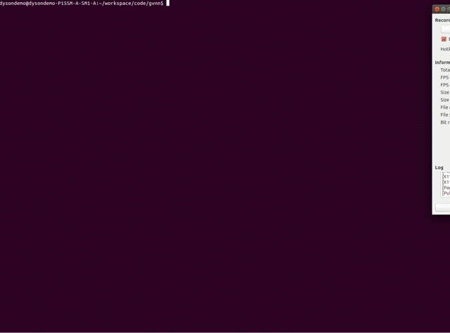
All the modules that are in the repository have been tested properly and pass the forward and backward pass checks as defined in the test.lua. In case of any errors or visible hot-spots you may find in the code, please create an issue.


SO3 Layer 
=============
Rotations are represented as so(3) 3-vector. This vector is turned into rotation matrix via the exponential map. For a more detailed view of the so(3) representation and exponential map read this tutorial from Ethan Eade: [Lie-Algebra Tutorial](http://www.ethaneade.com/latex2html/lie_groups/lie_groups.html). This is what the exponential map is [Exponential Map](http://www.ethaneade.com/latex2html/lie_groups/node37.html). Also, Tom Drummond's notes on Lie-Algebra are a great source to learn about exponential maps [Tom Drummond's notes](https://dl.dropboxusercontent.com/u/23948930/Papers/3DGeometry.pdf). The reason for choosing so3 representation is mainly due to its appealing properties when linearising rotations (via taylor series expansion) for iterative image alignment via classic linearise-solve-update rule. The figure below shows how linearisation for SO3 is fitting a local plane on the sphere 

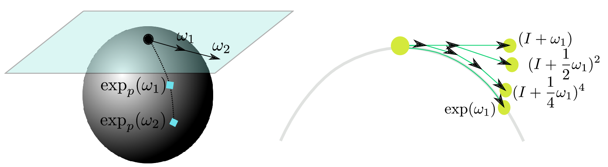


The backprop derivatives of this rotation parameterisation is all you need to make sure you can insert this layer within a network - the derivatives are a bit involved but they look like this 

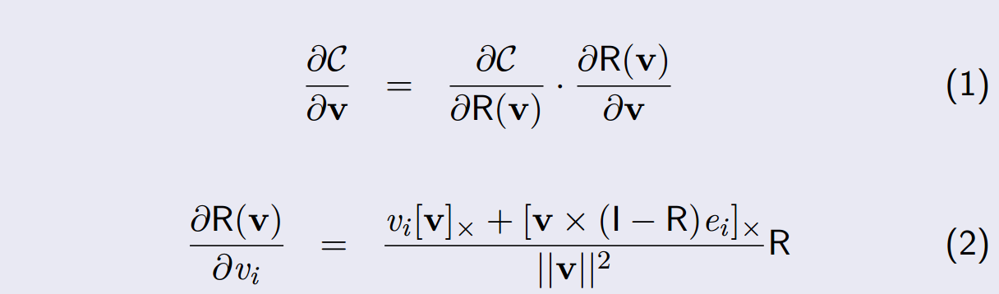

However, this derivative has singularity at (0,0,0) because of the division by the norm of the vector. Therefore, we have a threshold to check if the magnitude is small enough that we can use a first-order approximation of the exponential map. The derivatives of this linearised version are nothing but the Generators of the exponential map [Generators](http://www.ethaneade.com/latex2html/lie_groups/node36.html) 


To set up 3D rotation warping, you first need to homogenise the x,y positions to [x, y, 1]^T, apply the inverse camera calibration matrix to get the ray in 3D. This ray is rotated with the rotation and then backprojected into the 2D plane with PinHoleCameraProjection layer and interpolated with bilinear interpolation.

``` lua 
require 'nn'
require 'gvnn'

concat = nn.ConcatTable()

height = 240
width  = 320
u0     = 160
v0     = 120

fx = 240
fy = 240

-- first branch is there to transpose inputs to BHWD, for the bilinear sampler
tranet=nn.Sequential()
tranet:add(nn.SelectTable(1))
tranet:add(nn.Identity())
tranet:add(nn.Transpose({2,3},{3,4}))

rotation_net = nn.Sequential()
rotation_net:add(nn.SelectTable(2))
rotation_net:add(nn.TransformationRotationSO3())
rotation_net:add(nn.Transform3DPoints_R(height, width, fx, fy, u0, v0))
rotation_net:add(nn.PinHoleCameraProjectionBHWD(height, width, fx, fy, u0, v0))
rotation_net:add(nn.ReverseXYOrder())

concat:add(tranet)
concat:add(rotation_net)

warping_net = nn.Sequential()
warping_net:add(concat)
warping_net:add(nn.BilinearSamplerBHWD())
warping_net:add(nn.Transpose({3,4},{2,3}))

```

This is how to use the previous network to warp and plot the image

``` lua
require 'image'
require 'nn'
require 'torch'

dofile('imagewarpingSO3.lua')

x = image.loadPNG('linen1.png')
input = torch.Tensor(1,1,240,320)
input[1] = x

r = torch.Tensor(1,3):zero()
r[1][1] = 0.2
--r[1][2] = 0.3
--r[1][3] = 0.4

t = {input, r}

out_w = warping_net:forward(t)

w = out_w[1]

image.display(x)
image.display(w)

image.save('warped.png', w)
```

For running on cuda just do :cuda() wherever needed. *e.g.* warping_net = warping_net:cuda(), input = input:cuda() and r = r:cuda() 


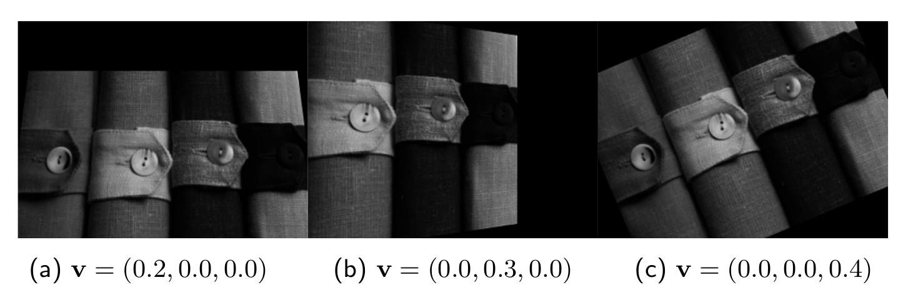

SE3 Layer
=============
``` lua
require 'nn'
require 'gvnn'

--dofile('ReverseXYOrder.lua')

concat = nn.ConcatTable()
concat_Rt_depth = nn.ConcatTable()


height = 480--240
width  = 640--320
u0     = 320--160
v0     = 240--120

fx =  480 --240
fy = -480 --240

-- first branch is there to transpose inputs to BHWD, for the bilinear sampler
tranet=nn.Sequential()
tranet:add(nn.SelectTable(1))
tranet:add(nn.Identity())
tranet:add(nn.Transpose({2,3},{3,4}))

-- converts the 6-vector (3-vector so3 for rotation and 3-vector for translation)
Rt_net = nn.Sequential()
Rt_net:add(nn.SelectTable(2))
Rt_net:add(nn.TransformationMatrix3x4SO3(true,false,true))

depth = nn.Sequential()
depth:add(nn.SelectTable(3))

concat_Rt_depth:add(Rt_net)
concat_Rt_depth:add(depth)

Transformation3x4net = nn.Sequential()
Transformation3x4net:add(concat_Rt_depth)
Transformation3x4net:add(nn.Transform3DPoints_Rt(height, width, fx, fy, u0, v0))
Transformation3x4net:add(nn.PinHoleCameraProjectionBHWD(height, width, fx, fy, u0, v0))
Transformation3x4net:add(nn.ReverseXYOrder())

concat:add(tranet)
concat:add(Transformation3x4net)

warping_net = nn.Sequential()
warping_net:add(concat)
warping_net:add(nn.BilinearSamplerBHWD())
warping_net:add(nn.Transpose({3,4},{2,3}))
```
``` lua
require 'gvnn'
require 'torch'
require 'image'

dofile('imagewarpingSE3.lua')

--local height=480
--local width =360

ref_rgb_image   = image.load('iclnuim/rgb/100.png')

ref_depth_image = image.load('iclnuim/depth/100.png')
ref_depth_image = (ref_depth_image*65535)/5000.0

print(ref_rgb_image:size())
print(ref_depth_image:size())

--image.display(ref_rgb_image)
--image.display(ref_depth_image)

data_ref_rgb      = torch.Tensor(1,3,480,640)
data_ref_rgb[1]   = ref_rgb_image

data_ref_depth    = torch.Tensor(1,1,480,640)
data_ref_depth[1] = ref_depth_image

so3_t_vector      = torch.Tensor(1,6):uniform()

-- tx, ty, tz, rx, ry, rz
-- -0.00119339 -0.00449791 -0.00122229 0.00104319 -0.00694122 -0.00333668

--- so3 and translation vector

so3_t_vector[1][1] = 0--  0.00104319
so3_t_vector[1][2] = 0-- -0.00694122
so3_t_vector[1][3] = 0-- -0.00333668

so3_t_vector[1][4] = 0-- -0.00119339
so3_t_vector[1][5] = 0-- -0.00449791
so3_t_vector[1][6] = 0-- -0.00122229

inputTable = {data_ref_rgb:cuda(), so3_t_vector:cuda(), data_ref_depth:cuda()}

outImage = warping_net:cuda():forward(inputTable)

image.display(outImage[1])
```
expand...

Optical Flow
=============
Optical flow is a 2D motion vector per-pixel. In many standard computer vision formulations, it is obtained via the solutions of a partial differential equations involving a data term which measures the pixel colour discrepency between the reference image at time *t* and a new image at time *t+1*, and a regulariser which helps smooth out the flow vectors at the neighbouring pixels. We provide two formulations of the optical flow vector *i.e.* the standard minimal parameterisation 2D vector and an over-parameterised 6DoF optical flow. Below, we show an example of how to use this layer to do self-supervised learning. The optical flow predicted by a convolutional LSTM is used to warp the frame at time *t* on frame at *t+1*. The relevant paper and code is available [here](https://github.com/viorik/ConvLSTM). 


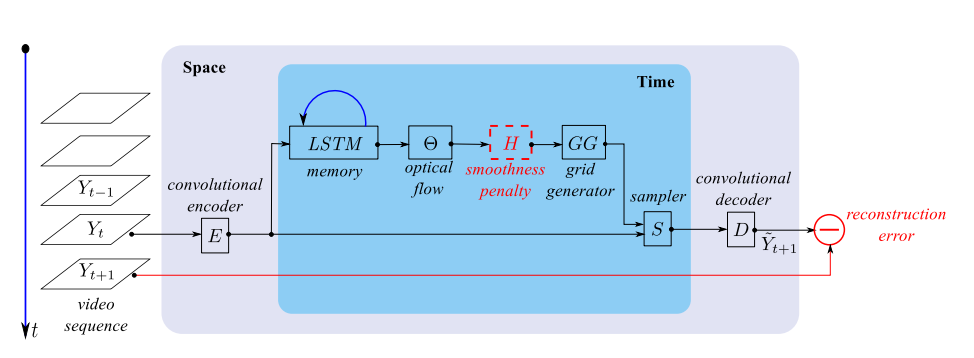

Spatio-temporal autoencoder with differential memory. *Viorica Patraucean, Ankur Handa, Roberto Cipolla*, ICLRWorkshop Track 2016


Disparity
=============
Again, standard low-level vision provides an intuitively appealing way to do self-supervised learning. Now let us imagine instead of two frames in a video what if we had a stereo pair? We can then warp the left frame on top of the right in a similar way where the network instead predicts the disparity. 


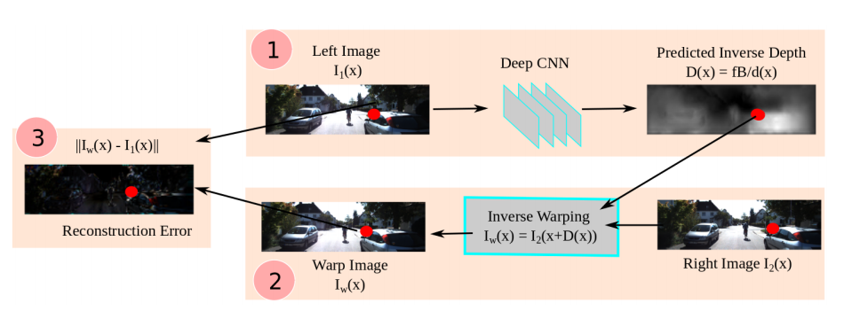

Unsupervised CNN for Single View Depth Estimation: Geometry to the rescue. *Ravi Garg, Vijay Kumar BG, Gustavo Carneiro, Ian Reid*, ECCV 2016.

Projection Layer
=============
The projection layer allows to project 3D data onto a 2D image plane via the projection matrix (in our case we use pin-hole camera projection matrix). This is extremely useful for data involving any 3D point cloud, depth and/or mesh and their projections in the 2D plane. This is differentiable only upto a point *i.e.* the forward/backward pass checks fail if the z-coordinate is below a certain threshold.

<center>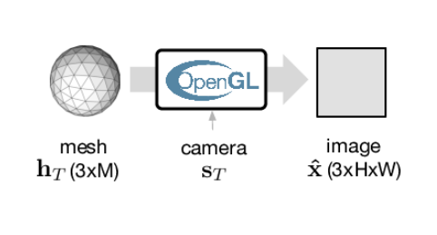</center>
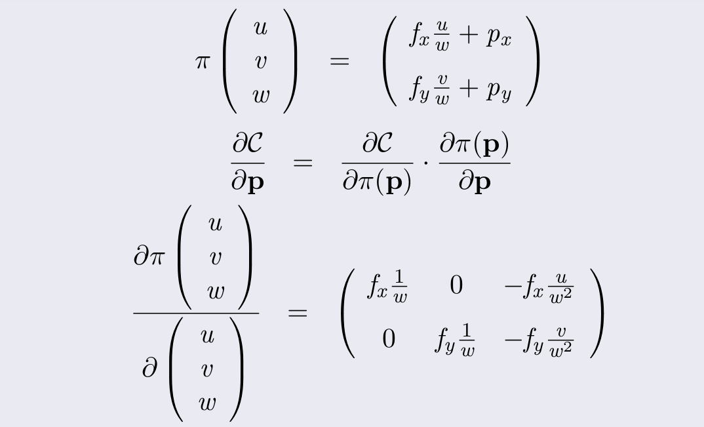

Lens Distortion
=============
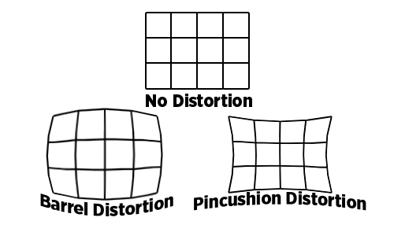
expand...

Nonrigid SO3
=============
expand...

Nonrigid SE3
=============
Tracking non-rigid deformable objects is possible via a full dense per-pixel SE3 motion field. We provide a non-rigid se3 layer which predicts per-pixel se3 vector that allows to warp one depth image onto another as a means to do self-supervised learning.

<center>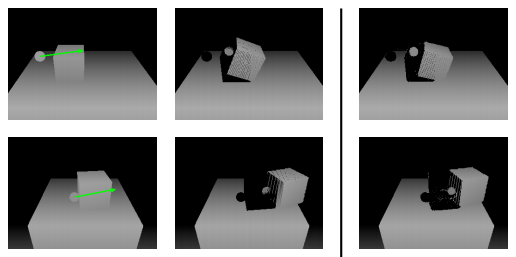</center>
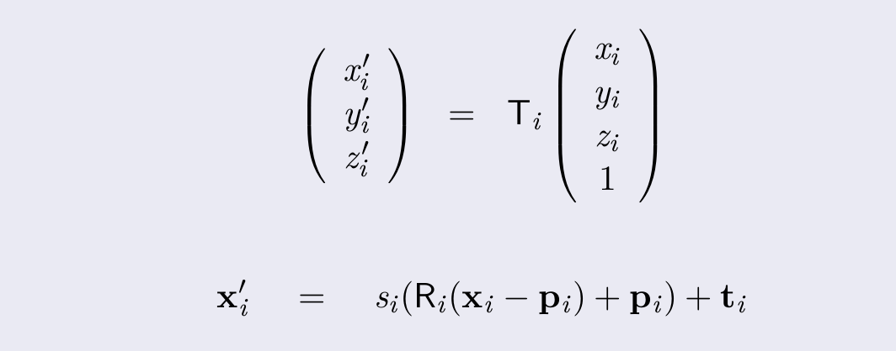

SE3-Nets: Learning Rigid Body Motion using Deep Neural Networks, *Arunkumar Byravan and Dieter Fox*, arXiv, 2016.

M-estimators
=============
M-estimators have a long history in traditional computer vision and statistics. Michael Black's early papers in the 90s provide a compendium of various m-estimators and how most of them are superior to the standard L2 loss function and their ability to cull the outliers from the estimation of model parameters. We provide 4 different m-estimators namely, L2, Huber, Cauchy and Tukey.
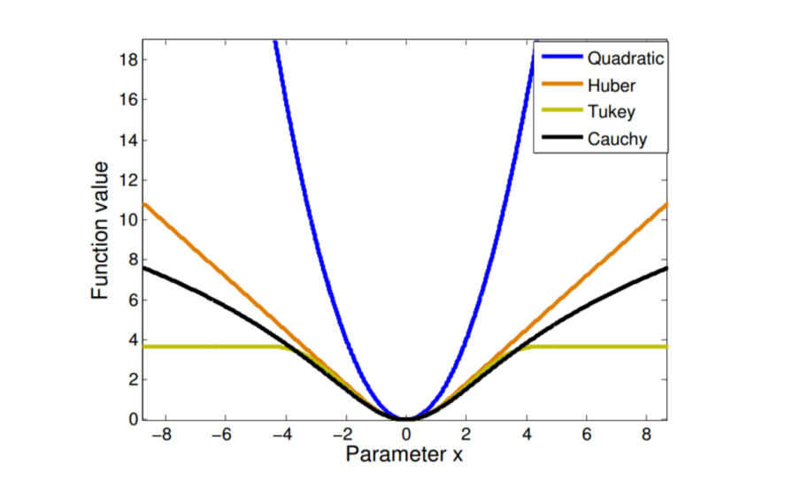


Future Improvements
=============
Bilinear interpolation can use the tex2D function within CUDA to speed up the interpolation. Also, need to add interpolation with taylor series expansion as done in classic PDE based variational optimisation methods. Warping should be done at a higher resolution and blurred and downsampled later on *i.e.* [DBW model used in Unger's super-resolution method](http://gpu4vision.icg.tugraz.at/papers/2010/dagm_2010_superresolution.pdf).

License 
=============
GPL. We would like to thank Dyson Technologies Limited for supporting this work.

Contact 
=============

Ankur Handa (handa(dot)ankur(at)gmail(dot)com)

Acknowledgements
=============

If you find the code useful, please consider citing the following 
```
@inproceedings{Handa:etal:ECCVW16,
  author    = {Ankur Handa and 
               Michael Bloesch and 
               Viorica P{\u a}tr{\u a}ucean and
               Simon Stent and
               John McCormac and
               Andrew Davison},
  title     = {gvnn: Neural Network Library for Geometric Computer Vision},
  booktitle = {ECCV Workshop on Geometry Meets Deep Learning},
  year      = {2016}
}
```
```
@Misc{STNImplementation,
    author = {Maxime Oquab},
    title={{Open Source Implementation of Spatial Transformer Networks}},
    howpublished={URL https://github.com/qassemoquab/stnbhwd},
    year={2015}
}
```
