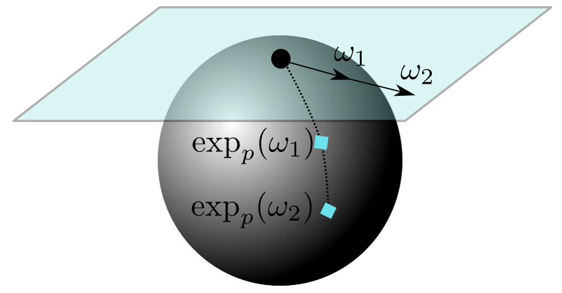

Link to the paper [gvnn](http://arxiv.org/pdf/1607.07405.pdf)

gvnn is inspired by the Spatial Transformer Networks (STN) paper that appeared in NIPS in 2015 and its open source code made available by [Maxime Oquab](https://github.com/qassemoquab/stnbhwd). The code is self contained i.e. the original implementation of STN by Maxime is also within the repository. 

STs were mainly limited to applying only 2D transformations to the input. We added a new set of transformations often needed for manipulating data in 3D geometric computer vision. These include the 3D counterparts of what were used in original STN together with a lot more new transformations and different M-estimators.

* SO3 layer   - Rotations are expressed in so3 vector (v1, v2, v3)
* Euler layer - Rotations are also expressed in euler angles
* SE3 and Sim3 layer 
* Camera Pin-hole projection layer
* 3D Grid Generator
* Per-pixel 2D transformations
    * 2D optical flow
    * 6D Overparameterised optical flow
    * Per-pixel SE(2)
    * Slanted plane disparity

* Per-pixel 3D transformations
    * 6D SE3/Sim3 transformations
    * 10D transformation

* M-estimators

We plan to make this a comprehensive and complete library to bridge the gap between geometry and deeplearning.


We are still performing large scale experiments on data collected both from real world and our previous work, [SceneNet](http://robotvault.bitbucket.org) to test our various different geometric computer vision algorithms e.g. dense image registration, 3D reconstruction and place recognition.


#Installation 

luarocks make gvnn-scm-1.rockspec

#SO3 Layer 
Rotations are represented as so(3) 3-vector. This vector is turned into rotation matrix via the exponential map. For a more detailed view of the so(3) representation and exponential map read this tutorial from Ethan Eade: [Lie-Algebra Tutorial](http://www.ethaneade.com/latex2html/lie_groups/lie_groups.html). This is what the exponential map is [Exponential Map](http://www.ethaneade.com/latex2html/lie_groups/node37.html). Also, Tom Drummond's notes on Lie-Algebra are a great source to learn about exponential maps [Tom Drummond's notes](https://dl.dropboxusercontent.com/u/23948930/Papers/3DGeometry.pdf). The reason for choosing so3 representation is mainly due to its appealing properties when linearising rotations (via taylor series expansion) for iterative image alignment via classic linearise-solve-update rule. The figure below shows how linearisation for SO3 is fitting a local plane on the sphere 




The backprop derivatives of this rotation parameterisation is all you need to make sure you can insert this layer within a network - the derivatives are a bit involved but they look like this 


However, this derivative has singularity at (0,0,0) because of the division by the norm of the vector. Therefore, we have a threshold to check if the magnitude is small enough that we can use a first-order approximation of the exponential map. The derivatives of this linearised version are nothing but the Generators of the exponential map [Generators](http://www.ethaneade.com/latex2html/lie_groups/node36.html) 


To set up 3D rotation warping, you first need to homogenise the x,y positions to [x, y, 1]^T, apply the inverse camera calibration matrix to get the ray in 3D. This ray is rotated with the rotation and then backprojected into the 2D plane with PinHoleCameraProjection layer and interpolated with bilinear interpolation.

``` lua 
require 'nn'
require 'gvnn'

concat = nn.ConcatTable()

height = 240
width  = 320
u0     = 160
v0     = 120

fx = 240
fy = 240

-- first branch is there to transpose inputs to BHWD, for the bilinear sampler
tranet=nn.Sequential()
tranet:add(nn.SelectTable(1))
tranet:add(nn.Identity())
tranet:add(nn.Transpose({2,3},{3,4}))

rotation_net = nn.Sequential()
rotation_net:add(nn.SelectTable(2))
rotation_net:add(nn.TransformationRotationSO3())
rotation_net:add(nn.Transform3DPoints_R(height, width, fx, fy, u0, v0))
rotation_net:add(nn.PinHoleCameraProjectionBHWD(height, width, fx, fy, u0, v0))
rotation_net:add(nn.ReverseXYOrder())

concat:add(tranet)
concat:add(rotation_net)

warping_net = nn.Sequential()
warping_net:add(concat)
warping_net:add(nn.BilinearSamplerBHWD())
warping_net:add(nn.Transpose({3,4},{2,3}))

```

This is how to use the previous network to warp and plot the image

``` lua
require 'image'
require 'nn'
require 'torch'

dofile('imagewarping.lua')

x = image.loadPNG('linen1.png')
input = torch.Tensor(1,1,240,320)
input[1] = x

r = torch.Tensor(1,3):zero()
r[1][1] = 0.2
--r[1][2] = 0.3
--r[1][3] = 0.4

t = {input, r}

out_w = warping_net:forward(t)

w = out_w[1]

image.display(x)
image.display(w)

image.save('warped.png', w)
```

For running on cuda just do :cuda() wherever needed. e.g. warping_net = warping_net:cuda(), input = input:cuda() and r = r:cuda() 


#SE3 Layer
expand...

#Optical Flow

expand...

#Disparity

expand...

#Projection Layer

expand...

#Lens Distortion

expand...

#Nonrigid SO3
expand...

#Nonrigid SE3

expand...

#M-estimators

expand...


#Future Improvements
Bilinear interpolation can use the tex2D function within CUDA to speed up the interpolation. Also, need to add interpolation with taylor series expansion as done in classic PDE based variational optimisation methods. Warping should be done at a higher resolution and blurred and downsampled later on i.e. DBW model used in Unger's super-resolution method.

#License 
This code is for mainly for research purposes and is licensed under GPL. If you'd like to use it for anything beyond research please contact us.
<!--
If you use the code, please consider citing the following 
```
@inproceedings{PatrauceanHC16,
  author    = {Ankur Handa and 
               Michael Bloesch and 
               Viorica P{\u a}tr{\u a}ucean and
               Simon Stent and
               John McCormac and
               Andrew Davison},
  title     = {gvnn: Neural Network Library for Geometric Computer Vision},
  booktitle = {arXiv:1607.07405},
  year      = {2016}
}
```
```
@Misc{STNImplementation,
    author = {Maxime Oquab},
    title={{Open Source Implementation of Spatial Transformer Networks}},
    howpublished={URL https://github.com/qassemoquab/stnbhwd},
    year={2015}
}
```
-->
